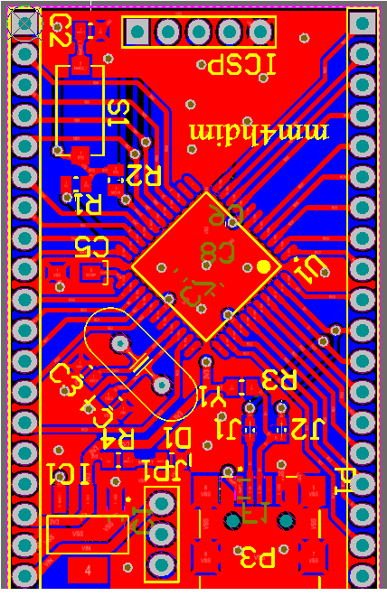
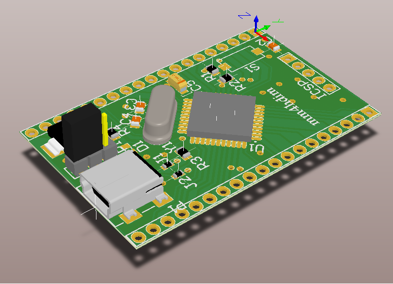

# PIC18F46J50 Header Board

  
   

## Header Board Features

- ICSP connector
- Rest button 
- Two power mode
  - exernal 
  - usb 
- USB mini connector

## Microcontroller Features:
- Integrated full speed USB 2.0
- Deep Sleep mode ideal for battery applications
- Peripheral Pin Select for mapping digital peripherals to various I/O for design flexibility
- Hardware RTCC provides clock, calendar & alarm functions
- Charge Time Measurement Unit (CTMU) supports capacitive touch screens
- 2 Enhanced Capture / Compare / PWM modules
- 2 MSSP serial ports for SPI or I2C communication
- 2 Enhanced USART modules
- 8-bit Parallel port
- Dual analog comparators
- 13 ch, 10-bit ADC
- Self programming Flash supports 10k erase/write cycles & 20 years retention
- Operating voltage 2.0 - 3.6V, 5.5V tolerant digital inputs

## Other 
- Change power mode with JP1
